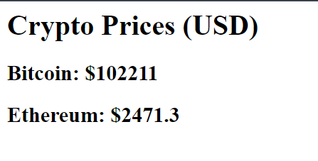
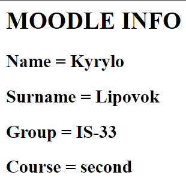

# 🧪 Лабораторна робота 6

### 📌 Завдання: 
- 6.2 Реалізувати на будь-якій мові програмування виклик API зовнішнього застосування і візуалізацію відповіді. Додати в GitHub код і опис прикладу застосування API. 
- 6.3 Реалізувати на будь-якій мові програмування http-сервер, організувати звертання до нього і отримати відповідь у браузері. Звертання має містити Ваш логін у Moodle. Відповідь має містити Ваші особисті дані (прізвище, ім’я, курс, група).


## 📄 Локальні ендпоінти вебсервера
- `http://localhost:8000/crypto`
- `http://localhost:8000/moodle`

## 🛠️ Реалізація
Проєкт реалізовано з використанням:
- **Python**
- **FastAPI** — асинхронний вебфреймворк
- **Requests** — HTTP-клієнт
- **dotenv** — для роботи зі змінними середовища
- **HTMLResponse** — для повернення HTML у відповідь
- **Uvicorn** — ASGI-сервер для запуску застосунку

---
## Сценарій використання: Курс криптовалют у реальному часі
Користувач надсилає запит на локальний сервер за маршрутом /crypto, вказуючи в параметрах запиту список криптовалют (наприклад: bitcoin, ethereum).

Сервер надсилає HTTP-запит до публічного API CoinGecko, який повертає актуальні курси в доларах США (USD) для запитаних валют.

Отримані дані перетворюються у формат HTML і повертаються користувачу як вебсторінка.

## 🔗 Зовнішній API
### 📦 CoinGecko (публічний API криптовалют)
- URL: `https://api.coingecko.com/api/v3/simple/price`
- Параметри:
  - `ids`: список криптовалют (наприклад, `bitcoin,ethereum`)
  - `vs_currencies`: валюта для порівняння (у нашому випадку — `usd`)

### 📄 Приклад запиту:

GET http://localhost:8000/crypto?currencies=bitcoin&currencies=ethereum


### 📄 HTML-відповідь:



### 🔗 Moodle endpoint

GET http://localhost:8000/moodle?login=student123

### 📄 Дані беруться зі змінних середовища .env:
```dotenv
MOODLE_LOGIN=student123
MOODLE_NAME=Іван
MOODLE_SURNAME=Петренко
MOODLE_GROUP=ІП-12
MOODLE_COURSE=Бази Даних
```

### 📄 HTML-відповідь:
